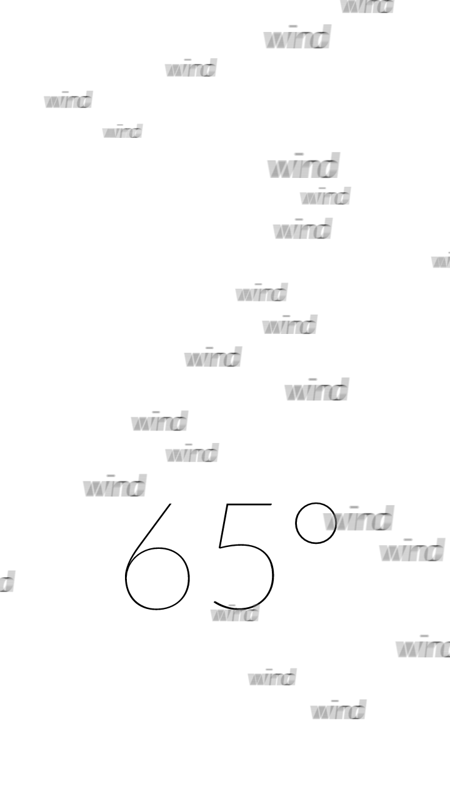

# Weather

Assignment: Create two visualizations of current conditions, one text-free (graphics-only) and the other text-only.

## Graphical Weather

For this assignment, I went beyond the 2D graphics of p5.js with some low-level WebGL shader code for nature-inspired effects. From water ripples to drifting clouds to light rays, each graphical nuance is packed with information: wind direction, cloud cover, even moon phase. Plus, an hourly forecast is depicted as animated slices of space.

[View in Browser](https://willy-vvu.github.io/Weather/Graphics/)

---

## Text-only Weather

With subtle use of motion blur and animated "particles", text and tone fill the role of graphic elements in this minimal monochrome visualization.

[View in Browser](https://willy-vvu.github.io/Weather/Text/)

---

Assignment for: 4.032 Information Design

Learning Focus: Low-Level WebGL, GLSL Shaders, Postprocessing, Motion Blur

Media: Data Visualization, Motion Graphic, Computer Graphics

Software: p5.js, WebGL, JavaScript

Date: March 2017
